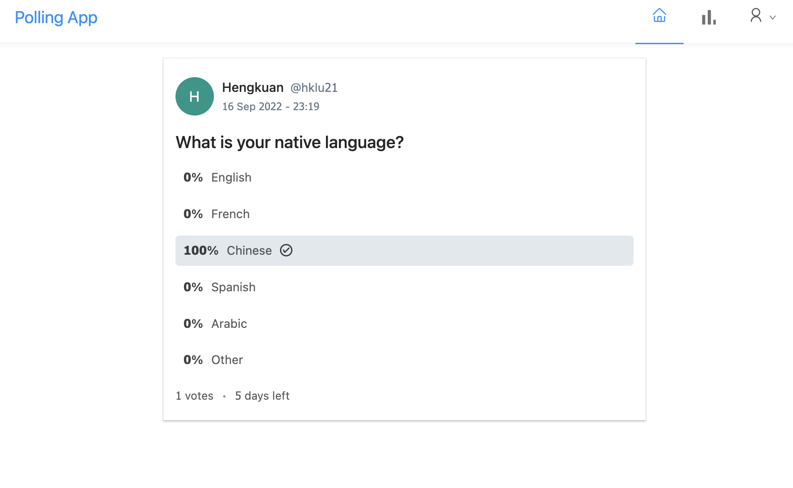

# Spring Boot Poll App

This is a polling app build with React, Spring Boot, Spring Security, JWT and MySQL. The framework style is following this [link](https://github.com/callicoder/spring-security-react-ant-design-polls-app). I add email verificaction for acount registration and some other server APIs for users and the administrator. The purpose for doing this project is to learn how to implement RESTful APIs in Java Spring Boot, how to design a login system configuring Spring Security and JWT(JSON Web Tokens) authentication and how to use Ant Design to build React front-end.

## Functionality

- Registration(with Email verification), Log in(with authenticatio), Log out

- view / edit user profile, manage owned polls

- view polls list, vote for polls

- create new polls (with expiration date) / delete unexpried polls

- (for Admin) delete / suspend any of the polls


## ScreenShots



## How to run

### build the polling application

``` SHELL
cd polling-frontend

npm install

npm run build
```

### create MySQL database

``` SHELL
create database polling_app
```
(change your configuration of MySQL username and password in the src/main/resources/application.properties file)

### run the sever

``` SHELL
cd polling-backend

mvn spring-boot:run
```

## Reference

[Spring Boot Polling App Tutorials](https://www.callicoder.com/spring-boot-spring-security-jwt-mysql-react-app-part-1/)

[Spring Boot Email Verification for User Registration Tutorial](https://www.codejava.net/frameworks/spring-boot/email-verification-example)
